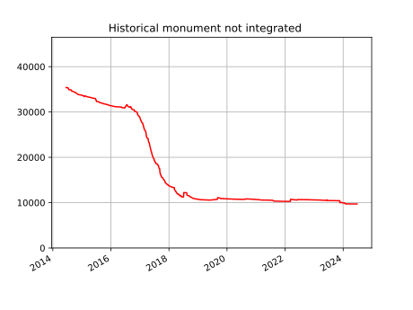
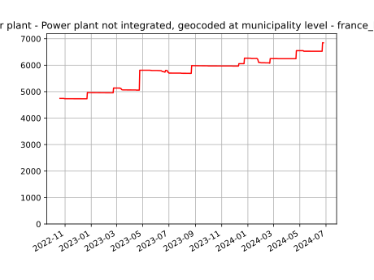
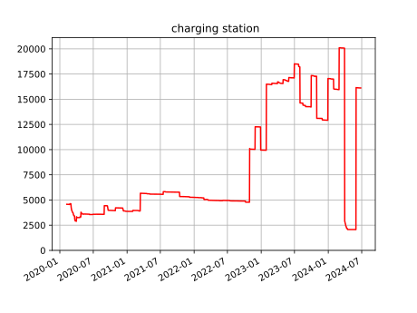

## Rediffusions
## d'OpenData
## enrichie
## par Osmose-QA

### SotM FR 2024

Frédéric Rodrigo

fred.rodrigo@gmail.com

---

# Osmose-QA

Signalement d'anomalies dans OSM

Signalement de données manquantes ou incomplètes depuis l'OpenData

----

## [Osmose Backend](https://github.com/osm-fr/osmose-backend/)

- 1000 analyseurs
- 600 régions
- 12 serveurs de calcul
- \+ Analyseurs tiers

----

## [Osmose Frontend](https://github.com/osm-fr/osmose-frontend/)

- 1 frontend
- [Carte de signalements](https://osmose.openstreetmap.fr/)
- API

----

## 4 types d'analyses

- SQL
- SAX : Python
- MapCSS
- Merge : OpenData

---

## Rapprochement d'OpenData
# À la BANO

- Existence de données ouvertes
  - Compatible OSM
  - Qualité mitigée
  - Couverture France / globale
- Difficulté d'import

----

## Rapprochement d'OpenData
# À la BANO

- Fusion des données OpenData et OSM
  - Données améliorées et complétées
    - Complétion réciproque
    - Position, géométrie, attribut
  - Priorité à la version OSM
    - OSM pour corriger et améliorer

---

# Comment ça marche

- Source
  - Format de fichier, metadata
- Conflation
  - Distance / ref
  - Point, Ligne, <del>Poly</del>
- Correspondance de tags
  - OpenData ➡ OSM

----

# Accueil par les communautés

- 3 pays, 3 histoires
  - France, Italie, Espagne
- Import déguisé : oui / non
- Édition mécanique déguisée : oui / non

----

# En sortie

- Amélioration d'OSM
- Maintenance dans le temps
  - Comme des tests unitaires (TU)
  - Statistiques
- CSV "byOSM" : OSM amélioré de l'OpenData
  - Correction de position et d'attributs
  - Attributs annexes
  - Géométrie
  - Au schéma de tags OSM
  - Listé sur DataGouv

---

## Immeubles protégés au titre des Monuments Historiques

- OpenData
  - [Ministère de la Culture : Base Mérimée](https://www.data.gouv.fr/fr/datasets/liste-des-immeubles-proteges-au-titre-des-monuments-historiques-archives/) - 46k
  - Localisation par géocodage
- Osmose
  - [Jointure OSM par `ref:mhs`](https://github.com/osm-fr/osmose-backend/blob/master/analysers/analyser_merge_heritage_FR_merimee.py#L46)
  - Résultats [[1]](https://osmose.openstreetmap.fr/fr/issues/open?item=8010&class=1) [[2]](https://osmose.openstreetmap.fr/fr/issues/open?item=7080)
  - ["byOSM" sur DataGouv](https://www.data.gouv.fr/fr/datasets/immeubles-proteges-au-titre-des-monuments-historiques-openstreetmap-opendata/)

----

La plus ancienne analyse de rapprochement.

Pourquoi reste-t-on sur un palier ?

---

## Production et stockage
## d'électricité

- OpenData
    - [ODRÉ](https://odre.opendatasoft.com/explore/dataset/registre-national-installation-production-stockage-electricite-agrege/information/?disjunctive.epci&disjunctive.departement&disjunctive.region&disjunctive.filiere&disjunctive.combustible&disjunctive.combustiblessecondaires&disjunctive.technologie&disjunctive.regime&disjunctive.gestionnaire&sort=codeinseecommune)
    - Publié à la maille communale
- Osmose
  - [Jointure par distance (5km)](https://github.com/osm-fr/osmose-backend/blob/master/analysers/analyser_merge_power_plant_FR.py#L32)
  - Résultats sur Osmose [[1]](https://osmose.openstreetmap.fr/en/issues/open?item=8270&class=1&country=france_local_db&start_date=2022-10-20)
  - ["byOSM" sur DataGouv](https://www.data.gouv.fr/fr/datasets/registre-national-des-installations-de-production-et-de-stockage-delectricite-de-plus-de-250-kw-openstreetmap-opendata/)

----

Ça monte !

Le terrain bouge plus vite que la carto ?

---

## Recharge véhicules électriques

- OpenData
  - [Fichier consolidé des Bornes de Recharge pour Véhicules Électriques (IVRE)](https://www.data.gouv.fr/fr/datasets/fichier-consolide-des-bornes-de-recharge-pour-vehicules-electriques/) - entre 75k et 95k points de charge
- Retraitement
  - [BastienGauthier/clean_french_irve](https://github.com/BastienGauthier/clean_french_irve) - 96k points de charge, 25k stations
  - [Jungle-Bus/ref-EU-EVSE](https://github.com/Jungle-Bus/ref-EU-EVSE) - 18k stations
- ChargeMap - 205k points de charge, 40k stations

----

## Recharge véhicules électriques

- Osmose
  - [Jointure par `ref:EU:EVSE`](https://github.com/osm-fr/osmose-backend/blob/master/analysers/analyser_merge_charging_station_FR.py#L55)
  - Résultats sur Osmose [[1]](https://osmose.openstreetmap.fr/fr/issues/open?item=8410) [[2]](https://osmose.openstreetmap.fr/fr/issues/open?item=8411)
  - ["byOSM" sur DataGouv](https://www.data.gouv.fr/fr/datasets/stations-de-recharge-pour-vehicules-electriques-openstreetmap-opendata) - 31k
- [Projet du mois](https://projetdumois.fr/projects/2020-03_evcharging)

----

Un sujet compliqué !

Tendance à la baisse.

----

## Recharge véhicules électriques
# en Italie

Exactement la même chose qu'en France
- Données remontées par les opérateurs dans un référentiel national
- Besoin de retraiter les données diffusées pour nettoyer
- Demande d'intégration à Osmose

---

## 100 jeux de données
- Défibrillateurs
- Pharmacies (fr, it)
- Stations Service (fr, it)
- Boîtes aux lettres postales
- Toilettes publiques
- ...

---

# Ensuite

- Améliorer l'aide à la contribution
  - Signaler l'avancement de l'intégration, augmentation des faux-positifs

- Retours vers les producteurs de données
  - Dashboard Opendata ⬌ OSM
  - Remontée des faux-positifs
    - Utilisation comme signalement [IGN](https://espacecollaboratif.ign.fr/georem/?territory=&openingDate=&updatingDate=&closingDate=&inputDevice=&comment=osmose&attributes%5B0%5D=1::Administratif&attributes%5B1%5D=1::Adresse,%20Lieux-dits&attributes%5B2%5D=1::B%C3%A2ti&attributes%5B3%5D=1::Contr%C3%B4les%20DGFIP&attributes%5B4%5D=1::Points%20d%27int%C3%A9r%C3%AAt&attributes%5B5%5D=1::Route&attributes%5B6%5D=13::Autre&attributes%5B7%5D=13::Parcelles,%20Cadastre&attributes%5B8%5D=13::Sentier,%20GR&submit=&author=&commune=&box=&numberByPage=10)

----

# Ensuite

- Améliorer la rediffusion
  - Consolider les départements
  - Plus de fiches DataGouv
  - Extract France OSM+OpenData
    - Alternative OSM à Ouverture Maps
    - Compléter avec d'autres thèmes
      - Opendata d'Osmose, BANO, Cadastre, Landuse
    - Exclure les faux positifs des exports

---

## Conclusion
# OpenData ⨉ OSM = ❤️ Osmose-QA

- Garder les données à jour
- Amélioration réciproque
- Proposer des données OSM plus complètes et utilisables
- Vers plus de collaboration entre communautés OSM et producteurs d'OpenData
